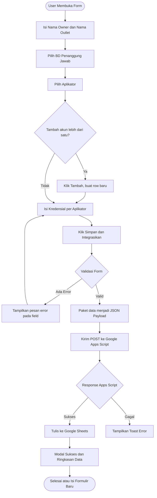
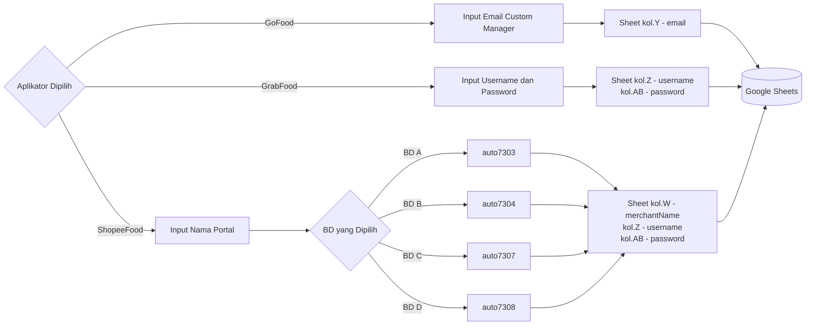

# Portal Kredensial SuperFood (Vercel-Ready)

Website formulir integrasi modern dan premium untuk melengkapi data owner, nama outlet, serta kredensial akses aplikator merchant secara adaptif (GoFood, Grab, dan Shopee). Proyek ini menggunakan skema branding SuperFood berwarna merah crimson mewah dan dirancang khusus untuk dideploy ke **Vercel** dengan performa maksimal, ramah SEO, dan bebas dari ketergantungan (dependencies) berat.

---

## 🔄 Alur Sistem

### Alur Pengisian & Pengiriman Data



### Logika Kredensial per Aplikator



---

## ✨ Fitur Utama
1. **Adaptive Input Fields**: Tampilan kolom kredensial akan otomatis berubah secara dinamis berdasarkan aplikator terpilih:
   * **GoFood**: Hanya menampilkan input **Email** dengan validasi regex email terdaftar.
   * **Grab**: Menampilkan input **Username** & **Password** (lengkap dengan penampil sandi/show password eye button).
   * **Shopee**: Hanya menampilkan input **Nama Portal Partner**.
2. **Desain Kaca Eksklusif (Glassmorphism)**: Estetika modern menggunakan *background blur*, gradien bercahaya (*glowing gradients*), serta elemen mesh background berpendar yang bergerak perlahan di latar belakang.
3. **Pilihan Aplikator Berbasis Kartu Visual**: Antarmuka selektor aplikator menggunakan ubin (*tiles*) interaktif yang bersinar sesuai warna identitas brand masing-masing aplikator (Merah GoFood, Hijau Grab, Oranye Shopee).
4. **Mode Gelap/Terang Instan (Dark/Light Switcher)**: Toggle tema sekali klik yang mengingat preferensi pengguna menggunakan penyimpanan lokal browser (`localStorage`) dan menyesuaikan dengan preferensi sistem OS.
5. **Form Engine Pintar**:
   * Validasi kolom real-time dengan ikon tanda centang hijau (valid) dan silang merah (invalid) disertai getaran visual (*shake animation*) jika ada error.
   * Modifikasi properti `required` secara dinamis di level HTML5 untuk field yang sedang aktif saja, mencegah kegagalan validasi pada field tersembunyi.
6. **Payload Visualizer & Export**:
   * Menampilkan representasi data akhir yang diisi dalam bentuk **JSON** bergaya code editor gelap.
   * Fitur salin JSON instan ke clipboard.
   * Fitur unduh berkas ekspor JSON dengan nama berkas pintar (`kredensial_[nama_outlet]_[aplikator].json`).
7. **Notifikasi Toast Premium**: Pemberitahuan melayang interaktif untuk setiap status aksi.

---

## 📁 Struktur Berkas

```text
website form/
├── index.html     # Halaman utama dengan markup HTML5 semantik & SVG terintegrasi
├── style.css      # Sistem desain lengkap, CSS Variables (HSL), animasi, & Glassmorphism
├── script.js      # Logika fungsional form, pergantian pane dinamis, & notifikasi toast
├── vercel.json    # Konfigurasi routing static file & clean URLs untuk Vercel
└── README.md      # Panduan dokumentasi pengoperasian & deployment
```

---

## 🚀 Cara Menjalankan Secara Lokal

Karena proyek ini menggunakan HTML, CSS, dan JavaScript murni berkinerja tinggi, Anda tidak perlu menginstal `npm modules` atau melakukan kompilasi bundler yang rumit. 

### Opsi A: Langsung Buka Berkas (Instan)
Klik dua kali berkas `index.html` pada File Manager Anda untuk langsung membukanya di browser apa saja.

### Opsi B: Menggunakan Dev Server Lokal
Untuk menyimulasikan lingkungan Vercel secara akurat (termasuk modul HTTP/HTTPS), disarankan untuk menjalankannya melalui server lokal:

1. **Menggunakan VS Code Live Server**:
   Jika Anda menggunakan Visual Studio Code, instal ekstensi **Live Server**, buka folder proyek ini, dan klik tombol **Go Live** di sudut kanan bawah.
2. **Menggunakan Python**:
   Jalankan perintah berikut di terminal Anda dalam folder ini:
   ```bash
   python -m http.server 8000
   ```
   Buka browser dan ketik alamat `http://localhost:8000`.
3. **Menggunakan Node.js (npx)**:
   Jalankan perintah server instan ini:
   ```bash
   npx serve .
   ```

---

## ☁️ Cara Deploy ke Vercel

Ada dua metode utama yang sangat mudah untuk mempublikasikan website ini ke Vercel agar dapat diakses oleh publik secara gratis.

### Metode 1: Menggunakan Vercel CLI (Sangat Cepat)
1. Buka terminal Anda dan masuk ke direktori proyek ini:
   ```bash
   cd "/mnt/DATA/Proyek/website form"
   ```
2. Pastikan Vercel CLI sudah terinstal. Jika belum, instal secara global:
   ```bash
   npm install -g vercel
   ```
3. Lakukan deploy secara instan:
   ```bash
   vercel
   ```
4. Masuk (*login*) ke akun Vercel Anda lewat terminal jika diminta, lalu ikuti instruksi pengaturan default (cukup tekan `Enter` untuk setiap opsi).
5. Vercel akan memberikan tautan publik instan untuk website Anda! Untuk mendeploy versi produksi final, jalankan:
   ```bash
   vercel --prod
   ```

### Metode 2: Menggunakan Dashboard Vercel & Integrasi GitHub (Otomatis)
1. Unggah (*push*) folder proyek ini ke repositori baru di akun **GitHub / GitLab / Bitbucket** Anda.
2. Buka dashboard [Vercel](https://vercel.com/) dan buat proyek baru dengan mengeklik tombol **Add New** -> **Project**.
3. Hubungkan akun GitHub Anda dan pilih repositori proyek ini.
4. Pada bagian konfigurasi, Vercel akan otomatis mengenali proyek ini sebagai **Other / Static Project** (karena ada `index.html` dan `vercel.json`).
5. Klik **Deploy**! Setiap kali Anda melakukan *push* perubahan baru ke repositori GitHub tersebut, Vercel akan memperbarui website Anda secara otomatis.

---

## 🎨 Spesifikasi Teknis Skema JSON Output

Saat formulir dikirimkan, sistem memaketkan data ke format JSON terstruktur berikut:

```json
{
  "namaOwner": "Budi Santoso",
  "namaOutlet": "Bakmi Rasa Premium",
  "aplikator": "Grab",
  "kredensial": {
    "username": "merchant_gourmet",
    "password": "sandiRahasiaMitra"
  },
  "metadata": {
    "waktuIntegrasi": "2026-05-19T03:55:00.000Z",
    "versiSkema": "1.0.0",
    "statusEnkripsi": "AES-256 Mocked"
  }
}
```
*Catatan: Skema kredensial akan otomatis menyesuaikan menjadi `{ "email": "..." }` jika memilih GoFood, atau `{ "namaPortal": "..." }` jika memilih Shopee.*
